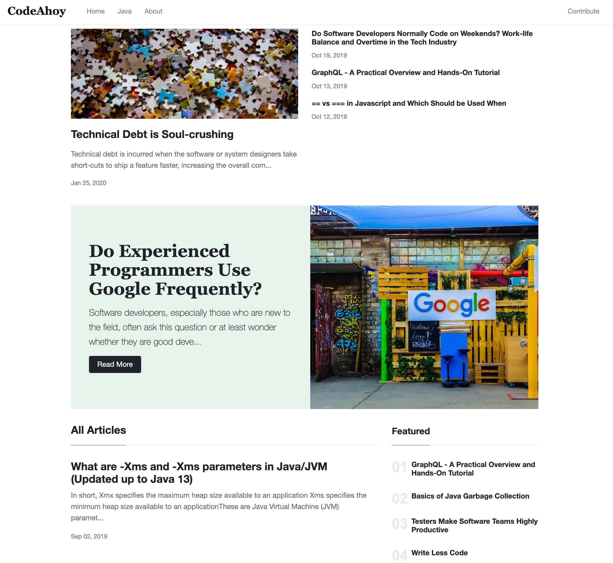

# Portal Jekyll Theme

Portal is a mobile-first Jekyll theme for technical blogs and websites. For more info, read this [blog post](https://codeahoy.com/2020/02/15/portal-jekyll-theme/).

## Live Demo

[CodeAhoy.com](https://codeahoy.com)



## Features
- Bootstrap 4.1 theme
- Featured posts
- Sticky posts
- Pagination
- Complete Jekyll integration
- About Me and Author pages
- Sitemap, Feed and Atom
- robots.txt
- Easy Mailchimp integration for newsletter sign-ups
- Easy Disqus integration

## How to use

These instructions assume you have Jekyll installed on your machine.

1. Clone the git repo

```
git clone https://github.com/umermansoor/Portal-Jekyll-Theme.git
```

2. Start the theme with sample blog contents

```
jekyll serve --watch
```

If everything works as expected, you should be able to see the theme with some sample contents at [http://127.0.0.1:4000/index.html](http://127.0.0.1:4000/index.html)

To start modifying the theme, update the `_config.yml` file. Blog posts go in the `_posts` folder. 

### Deploying Instructions and baseurl

You should always leave the `baseUrl` in `_config.yml` as empty e.g.

```
baseurl: ''
```

You should set the `url` property to the URL of your website if you are deploying it behind a domain. E.g.

```
url: https://codeahoy.com
```

## License

cc 4.0 with attribution. See LICENSE.md for more info

## Credits

This theme is based on [Mundana Jekyll theme](https://github.com/wowthemesnet/mundana-theme-jekyll) by WowThemes.net. I modified it to fit my requirements. Check these guys out and support their work.

## Known Issues (or things I plan on working next)

- Making the top navbar sticky on mobile
- Fixing Jumbotron and feature image.
- Reducing gap (empty space) between Jumbotron and blog start
- Removed unused CSS/JS files
- Use `async` and `defer` wherever applicable
- Remove JQuery (make it optional)
